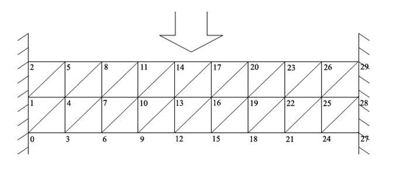

# FEM

This program solves the dynamic plane problem of the theory of elasticity using the finite element method (FEM). Triangles are used as finite elements. The bar fixed on sides is used as an example of the program application.

The program should be run with 2 parameters: the name of the input file and the name of the output file, for instance, `fem.exe in.txt out.html`.

The input file should contain the following data in such an order: 
-	the number of the nodes;
-	the nodes coordinates;
-	the number of the triangles;
-	the triangles tops in triples;
-	the number of the fixed nodes;
-	the fixed nodes;
-	the stress tensor components.

The attached "bar.txt" input file contains data for the bar depicted on the image below. 

The output file contains shifts of the nodes coordinates in different time stamps for the top, middle and bottom cuts of the bar.

